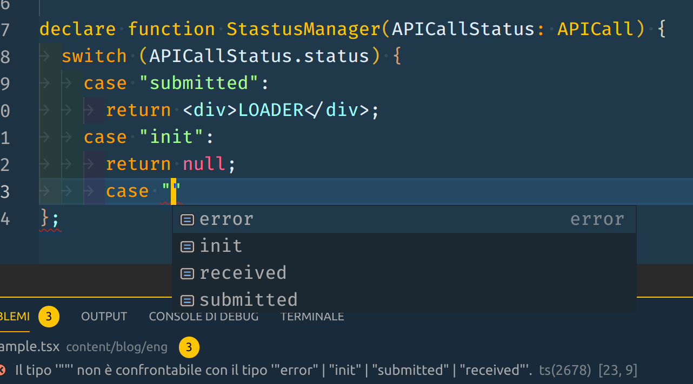
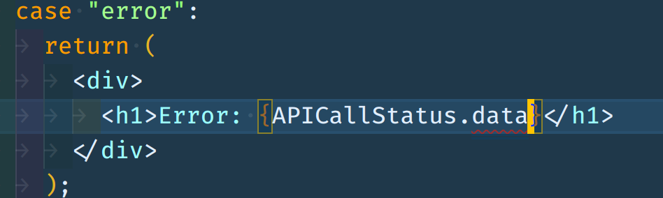

# Cook React with TypeScript and Algebraic Data Types

### What are ADTs?

A very simple and clear explanation can be taken right from the Wikipedia page:

> In computer programming, especially functional programming and type theory, an algebraic data type is a kind of composite type, i.e., a type formed by combining other types.>

> Two common classes of algebraic types are product types (i.e., tuples and records) and sum types (i.e., tagged or disjoint unions or variant types)>

_What does this mean?_

Well, it doesn't take too much immagination to create something that is a combination of two base types like number and strings:

```
type ActionType = string

type PayloadType = number

```

So, these are two type aliases that represent all the possible strings and all the possible numbers respectively and can be applied almost everywhere albeit being very generic.

Things start being more interesting when we combine them in another type that is somewhat a combination of the previous:

```
type action = {
    type: Actiontype,
    payload: PayloadType
}
```

We have just created a very basic type for a Redux action and we are telling to TS that our action can be any possible string as type and one of all the possible number as payload.

This our first _Product Type_:

> A Product type is the cartesian product of two or more types

We combine two types into one type that contains all the possible combinations between the two.

This, together with the ability to define a type as a subset of a type, is ideal to model data coming from an API or component's props:

```
type Props = {
    width: 1 | 2 | 3,
    height: 1 | 2 | 3
}
```

The product of the 3 possible values each combine in 9 possible values that we are allowed to pass down to the component reducing all the possible states to handle, and this is really interesting because, using these props we will be driven by the compiler to what is allowed and whatnot and giving you the freedom not to write that checks at runtime what input prop values come in.

Let's break down more this code.

Width as well as height are written with three numbers linked by the | (or) operator as it can be read as: 1 or 2 or 3

If you think about it, another way to use the | operator is right at type definition, just like those literal types:

```
type Props =
  | {
  type: 'responsive',
  width: 1 | 2 | 3
  }
  | {
  type: 'mobile',
  screen: 'iPhone' | 'iPad'
  }
```

Here, we are expicitly telling TS that Props can have 2 states, one for mobile and one for responsive with different props and these two state can be distinguished with a switch/case statement inside which we'll have the right prop associated to its type.

Since TS and Js don't have proper pattern matching, this is the best way to reach the same result avoiding a lot of boilerplate code for controlling input props, but letting do the dirty job to the TS compiler that will trow an error each time we try to send the wrong prop to the component.

Worth mention that an important thing to do is start thinking everything in terms of **states** and **type**, giving each one a proper name to write in a pivot field (doesn't necessarily be named 'type'), i.e. _theme_ would be perfect to describe css props.

The advantage of having props built this way is we can extensively use __switch/case__ statements and avoid lot of conditionalities to check whether properties are defined or not.

One classic situation in which this pattern is super useful is when we want to model an API call state:

```
type APICall<Tdata, Terror> =
| {
    status: 'init'
}
| {
    status: 'submitted'
}
| {
    status: 'received',
    data: Tdata
}
| {
    status: 'error',
    data: Terror
}
```

This also copes well with Redux where API call states can be stored and made available to connected components and in this way, if we know the what the API returns when the data return on error or when it's ok, we can pass the proper response data mode through generic.




With this structure the TS server will remember us what cases are to manage and the proper field associated to this state, especially using a switch/case conditional statement the ts-node server will help us to handle all the possible case as required in funtional programming and giving us a more readable stream of code, so this is the perfect match when it comes to handle all the possible cases coming from an API call as above example.



If we try to associate the data field with the error state, we get an error while typing, leading to avoid writing some code to control this, because is free since the moment we defined this kind of type.

So up until we won't get a proper pattern matching right in Js, this is the best way to use sort of pattern matching with TS, avoiding lots of boilerplate, get a clearer image of states inside a React components and possibly more readable props interfaces.

### References

- [Giulio Canti's Talk on ADT](https://github.com/gcanti/talks/blob/master/adt/adt.md)
- [Discriminated unions in TS](https://www.typescriptlang.org/docs/handbook/advanced-types.html#discriminated-unions)
- [Bartosz Milewski Programming Cafe](https://bartoszmilewski.com/2015/01/13/simple-algebraic-data-types/)
- [Wikipedia's Algebraic Data Type page](https://en.wikipedia.org/wiki/Algebraic_data_type)
- [Jack Hsu Blog](https://jaysoo.ca/2017/04/30/learn-fp-with-react-part-1/)
